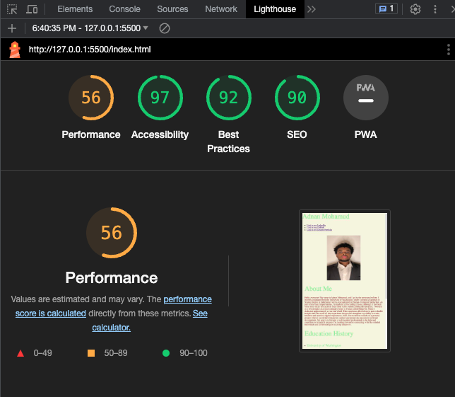

# LAB - 2

## About Me

I am currently working on a personal website project where I showcase my skills and experiences. My name is Adnan Mohamud, and I am utilizing the knowledge I gained from my classes to build this website. By employing HTML, CSS, and JavaScript, I am able to create a dynamic and visually appealing web presence. This project allows me to demonstrate my proficiency in these languages and apply them to real-world scenarios. I am excited to share my journey and accomplishments through this personal website as I continue to enhance my skills and pursue my passion for web development.

### Author: Adnan Mohamud

### Links and Resources

### Lighthouse Accessibility Report Score

### Reflections and Comments

### Day 1:

Some of the tools I learned so far were some of the different types such as strings, booleans, and numbers which I was able to use some of them on my project. I also learned how to declare variables such as 'const' or 'let'. Those wer just some of the things I learned so far there are many more.

### Day 2:

Some tools that I learned today were how to use arrays and that it can store multiple variables and it can also be a list, collection, etc. Each element in the arrayhas an index(number). We know it is an array if it has square brackets around it. We also learned about for loops and while loops in class today which I was able to use in todays project.

# Collaborations

David Segura was the Driver for Lab 4 assignment and collaborated adding functions to the questions. Adnan was the navigator for the assignment.
